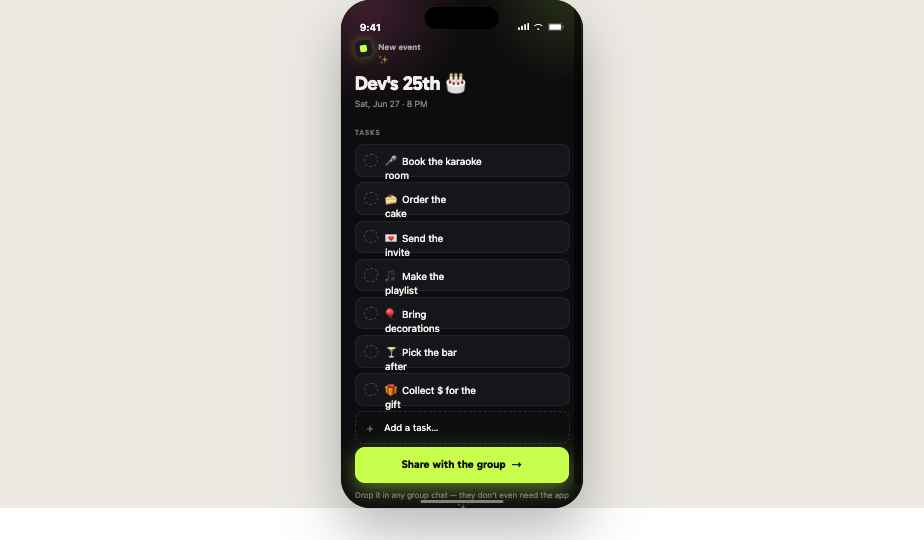
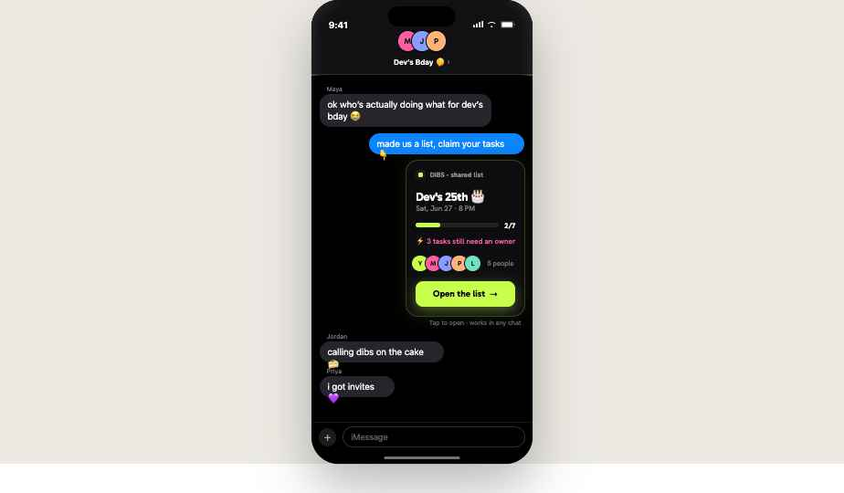
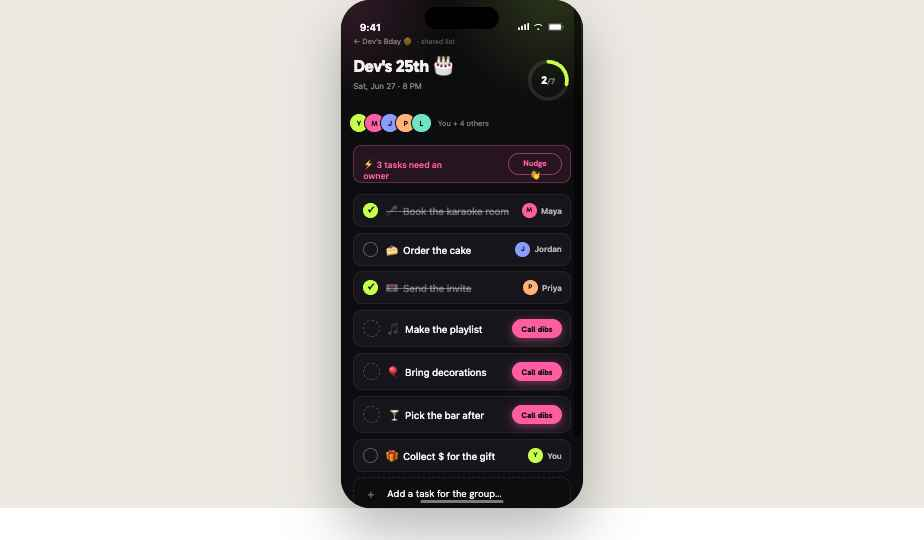
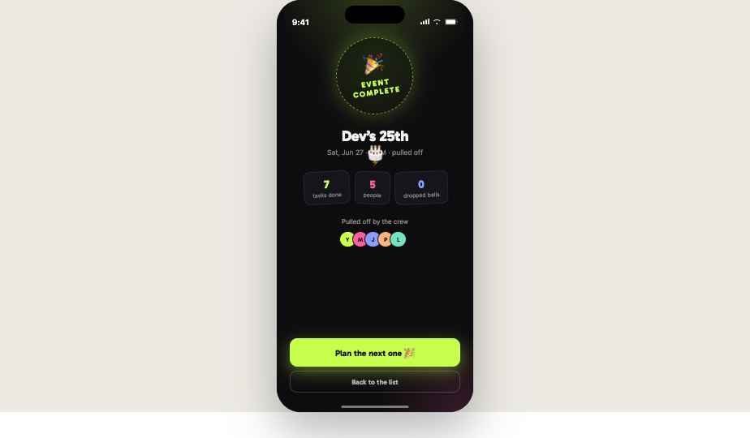

# Handoff: Dibs by Kansoboard — text-to-create joint to-do list

> **Product context:** **Dibs** is a subfeature offering by **Kansoboard** (kansoboard.com). It should be implemented as part of the Kansoboard product and follow Kansoboard's broader account, data, and brand conventions where they exist — this document specs the Dibs feature's own UI, which is intentionally distinct (playful, consumer-facing) and may diverge from Kansoboard's core surfaces. Refer to it in product/UI as **"Dibs by Kansoboard"** (or just **Dibs** in-feature, with Kansoboard as the parent brand).

## Overview
**Dibs by Kansoboard** is a frictionless shared to-do feature for ad-hoc group projects (planning a birthday, a trip, a potluck). One person sets up a list, drops it into a group chat as a rich card, and everyone can **call dibs** on (claim) tasks, check them off, add new ones, and watch a shared progress ring fill up — no app install, no logins. The reference scenario throughout is **"Planning Dev's 25th Birthday Party."**

The product has four screens that form one linear flow:
**Set Up → Share → List → Complete.**

The signature mechanic is **calling dibs**: unclaimed tasks show a pink "Call dibs" button; tapping it assigns the task to you (your avatar appears, confetti fires, the "needs an owner" count drops).

---

## About the Design Files
The files in this bundle are **design references created in HTML** — a working prototype that demonstrates the intended look, motion, and behavior. **They are not production code to copy directly.**

- `Dibs.dc.html` is a self-contained interactive prototype. It happens to be authored as a "Design Component" (a small streaming-render format); `support.js` is only the runtime that lets the prototype open in a browser. **Do not port `support.js` or the Design Component format** — it is scaffolding, not part of the product.
- Your task is to **recreate these designs inside the Kansoboard codebase** using its established stack, patterns, and libraries (auth, data layer, component primitives, etc.). If the Dibs feature is being built before any shared codebase exists, this is a mobile-first web app — **React (or Next.js) + plain CSS / CSS-in-JS / Tailwind** is a natural fit. The "phone" you see in the prototype is just a presentation bezel; the real product is the **screen content** (390px-wide mobile viewport), plus an iMessage rich-link card.
- To view the reference: open `Dibs.dc.html` in a browser with an internet connection (it loads Google Fonts and the runtime). Use the step pills beneath the phone to move between screens.

---

## Fidelity
**High-fidelity (hifi).** Colors, typography, spacing, radii, shadows, copy, and interactions are final and intentional. Recreate the UI pixel-accurately. The only "chrome" you should treat as throwaway is the iPhone bezel, status bar, dynamic island, home indicator, and the gray marketing backdrop around the phone — those exist only to present the mobile screens.

---

## Screenshots
Rendered reference images of each screen are in `screenshots/` (full mobile screen, chrome stripped):

| Screen | File |
|---|---|
| 1 · Set Up | `screenshots/01-set-up.png` |
| 2 · Share (Dibs card in thread) | `screenshots/02-share.png` |
| 3 · List (the shared workspace) | `screenshots/03-list.png` |
| 4 · Complete (payoff) | `screenshots/04-complete.png` |

## Platform & Layout Model
- **Mobile-first.** Design viewport is **390px wide** (content area inside the bezel). Target a single responsive mobile column; it should also work in a desktop browser centered at ~390–440px.
- Each screen is a full-height vertical **flex column** (`min-height: 100%`, `box-sizing: border-box`) on a near-black background, with content padded ~`56–64px` top (clears the OS status bar) and ~`30px` bottom (clears the home indicator). In a real app these become safe-area insets.
- Screens scroll vertically within the viewport.
- The **Share** screen is an **iMessage thread** mockup — in production this is two things: (1) a real **iMessage rich link / App Message card** rendered in the Messages thread, and (2) the in-thread experience. Treat the thread bubbles as illustration of context; the deliverable from this screen is the **Dibs card** design (documented below).

---

## Design Tokens

### Color
| Token | Hex / value | Use |
|---|---|---|
| `--bg` | `#0d0d0f` | App background (near-black, slightly warm) |
| `--bg-imessage` | `#000000` | Pure black, used for the Messages thread screen |
| `--surface` | `#16151b` | Task rows, cards, stat chips |
| `--surface-2` | `#1b1a20` | Eyebrow chip / small badges |
| `--bubble-in` | `#26252b` | Incoming iMessage bubble |
| `--text` | `#f5f3ef` | Primary text (warm white) |
| `--text-60` | `rgba(245,243,239,0.6)` | Secondary text |
| `--text-50` | `rgba(245,243,239,0.5)` | Tertiary / dates |
| `--text-40` | `rgba(245,243,239,0.4)` | Muted / hints, completed task text |
| `--hairline` | `rgba(255,255,255,0.06)` | Card/row borders |
| `--hairline-strong` | `rgba(255,255,255,0.1)` | Stronger dividers |
| `--lime` | `#c8ff4d` | **Primary accent** — progress, primary CTAs, "you" |
| `--lime-deep` | `#9bd62e` | Gradient partner / darker lime for light backgrounds |
| `--pink` | `#ff5da2` | **Secondary accent** — "Call dibs", "needs an owner" |
| `--periwinkle` | `#8b9cff` | Member avatar color |
| `--peach` | `#ffb27a` | Member avatar color |
| `--mint` | `#6fe3c2` | Member avatar color |
| `--imessage-blue` | `#0a84ff` | Outgoing iMessage bubble |
| `--canvas` | `#ECEAE3` | Marketing backdrop behind the phone (presentation only) |
| `--ink` | `#0d0d0f` | Text on light backdrop |
| `--ink-muted` | `#6b6862` | Muted text on light backdrop |

On all bright accent colors, text/icons are dark `#0d0d0f`.

### Accent glows (box-shadow)
- Lime CTA glow: `0 10px 32px rgba(200,255,77,0.42)`
- Lime card/button soft glow: `0 6px 22px rgba(200,255,77,0.38)` / `0 0 30px rgba(200,255,77,0.10)`
- Pink button glow: `0 4px 16px rgba(255,93,162,0.45)`
- Seal glow: `0 0 42px rgba(200,255,77,0.28)`

### Radial background washes (decorative, behind screen content)
- Pink wash: `radial-gradient(circle at 30% 25%, rgba(255,93,162,0.18–0.22), transparent 62%)`
- Lime wash: `radial-gradient(circle at 70% 20%, rgba(200,255,77,0.14–0.16), transparent 62%)`
- Placed absolutely in screen corners, `pointer-events: none`, under content.

### Typography
- **Display / UI headings / numbers:** **Gabarito** (Google Fonts), weights 400–900. Weights used: 600 (eyebrows/labels), 700 (titles/buttons), 800 (big numbers, seal, complete title).
- **Body / UI text:** **Hanken Grotesk** (Google Fonts), weights 400–800. Default 500–600 for task text.
- **iMessage chrome only:** `-apple-system, system-ui` (to read as native Messages).
- Type sizes (px): big screen title 28–32 (Gabarito 700/800, letter-spacing −0.8 to −1px, line-height ~1.1); section eyebrow 12–14 (uppercase, letter-spacing 1.5px for "TASKS"); task title 16 (Hanken 500); buttons 15–18 (Gabarito 700); body/bubbles 16; small meta 11–13; stat numbers 22 (Gabarito 800); seal labels 15 (Gabarito 800, letter-spacing 2.5px).

### Spacing & radii
- Screen padding: `64px 22px 30px` (Set Up), `56px 20px 30px` (List), `74px 26px 40px` (Complete).
- Card/row radius: 14–15px (task rows), 22px (iMessage Dibs card), 13–16px (buttons), 9–13px (chips/badges).
- Pills (Call dibs, Nudge, step controls): `border-radius: 99px`.
- Avatars: circle (`border-radius: 50%`), 24–34px depending on context, `2px solid #0d0d0f` ring, overlapped with `margin-left: -8px` in stacks.
- Gaps between task rows: 9px (flex column with `gap`).
- Phone bezel (presentation only): 390×820, radius 48px.

### Motion
- `dibsConfetti` keyframe: `translateY(0) rotate(0)` → `translateY(440px) rotate(680deg)`, opacity 1→0. 20 pieces, each 6–12px × 9–17px, colors cycle [lime, pink, periwinkle, peach, mint, white], duration 900–1650ms, random 0–200ms delay, easing `cubic-bezier(.2,.6,.4,1)`. Pieces spawn at top, random `left%`, cleared after 1750ms.
- `dibsPop` (claimed-by-you avatar entrance): scale `0.4 → 1.12 → 1`, opacity 0→1, 0.4s ease.
- `dibsToast` (toast in): opacity 0→1, translateY 14px→0, 0.3s ease. Toast auto-dismisses after ~1900ms.
- Progress ring: `transition: stroke-dashoffset .6s cubic-bezier(.4,0,.2,1)`.
- **Signature motif:** small "stamp" elements are **rotated** (`rotate(-8deg)` for the eyebrow chip and Complete seal; `±2–3deg` on the Complete stat chips) to give a sticker-like, hand-placed feel. This is part of the brand — keep it.

---

## Screens / Views

### 1. Set Up  (`screen = 'create'`)  — the first moment
**Purpose:** The host names the event and reviews/edits the auto-suggested task list, then shares it.

**Layout:** Full-height flex column, `#0d0d0f`, padding `64px 22px 30px`, `position: relative; overflow: hidden`. Two decorative radial washes in the top corners (pink top-left, lime top-right) behind content.

**Components (top → bottom):**
- **Eyebrow row:** a 28px rounded-square "stamp" badge (`#1b1a20`, `border-radius: 8px`, `rotate(-8deg)`, lime glow `0 0 14px rgba(200,255,77,0.35)`) containing a 12px lime rounded square; next to it the label **"New event ✨"** (Gabarito 600, 14px, `--text-60`).
- **Title input:** editable text, the event name **"Dev's 25th 🎂"** (Gabarito 700, 32px, letter-spacing −1px, lime caret, transparent background, no border). Editing it updates the title everywhere (Share card, List, Complete).
- **Date line:** "Sat, Jun 27 · 8 PM" (14px, `--text-50`).
- **Section label:** "TASKS" (Gabarito 600, 12px, uppercase, letter-spacing 1.5px, `--text-40`, margin `30px 0 12px`).
- **Task rows** (one per task): flex row, `#16151b`, `1px solid var(--hairline)`, radius 14px, padding `13px 14px`, gap 12px. Left: an 18px **dashed circle** (`2px dashed rgba(245,243,239,0.22)`) placeholder. Then `{emoji}  {title}` (16px, Hanken 500).
- **Add-task row:** dashed-border row (`1px dashed rgba(255,255,255,0.12)`), a "+" glyph, and an input placeholder "Add a task…". Enter (or the +) appends a new **unclaimed** task (default emoji ✨).
- **Primary CTA:** full-width **"Share with the group →"** — lime `#c8ff4d`, dark text, Gabarito 700, 18px, radius 16px, padding 17px, glow `0 10px 32px rgba(200,255,77,0.42)`. Navigates to **Share**.
- **Helper text:** "Drop it in any group chat — they don't even need the app ✨" (13px, `--text-40`, centered).

### 2. Share  (`screen = 'thread'`)  — the magic moment
**Purpose:** Show the list landing in a group chat as a rich **Dibs card**. In production: an iMessage rich-link / App Message card.

**Layout:** Pure-black Messages screen. Sticky **chat header** (blurred translucent bar, `backdrop-filter: blur(12px)`): overlapping member avatars (Maya/Jordan/Priya) + group name **"Dev's Bday 🤫 ›"**. Scrollable message area below. iMessage input bar pinned at bottom ("+" circle + rounded "iMessage" field).

**Message bubbles** (illustrative context): incoming bubbles `#26252b` left-aligned with small gray sender name above; outgoing bubbles `#0a84ff` right-aligned; `border-radius: 19px`, padding `8–9px 14px`, 16px text, max-width ~76–82%. Sample copy:
- Maya (in): "ok who's actually doing what for dev's bday 😭"
- You (out): "made us a list, claim your tasks 👇"
- *(the Dibs card)*
- Jordan (in): "calling dibs on the cake 🍰"
- Priya (in): "i got invites 💜"

**THE DIBS CARD** (the real deliverable of this screen) — right-aligned, max-width ~84%:
- Container: `#0d0d0f`, `1px solid rgba(200,255,77,0.22)`, radius 22px, shadow `0 0 30px rgba(200,255,77,0.1), 0 8px 30px rgba(0,0,0,0.5)`. Inner padding `15px 16px 16px`.
- Header chiplet: tiny `#1b1a20` rounded square w/ lime dot + label **"DIBS · shared list"** (Gabarito 600, 12px, letter-spacing 0.3px, `--text-50`).
- Title: event name (Gabarito 700, 21px). Date line below (13px, `--text-50`).
- **Progress bar:** track `rgba(255,255,255,0.09)`, height 8px, radius 99px; fill lime, width = % complete; trailing count "{done}/{total}" (Gabarito 600, 13px).
- **Needs-owner line:** "⚡ {n} tasks still need an owner" (pink, 13px, weight 600).
- **Crew stack:** overlapping 28px avatars (all 5 members) + "5 people".
- **CTA:** full-width lime **"Open the list →"** (Gabarito 700, 16px, radius 13px, glow `0 6px 22px rgba(200,255,77,0.38)`). Navigates to **List**.
- Caption under card: "Tap to open · works in any chat".

### 3. List  (`screen = 'list'`)  — the shared workspace
**Purpose:** Everyone claims tasks (calls dibs), checks them off, adds tasks, and tracks progress.

**Layout:** `#0d0d0f`, padding `56px 20px 30px`, `position: relative; overflow: hidden`, two corner radial washes (lime top-right, pink top-left).

**Components (top → bottom):**
- **Breadcrumb:** "← Dev's Bday 🤫 · shared list" (12px muted).
- **Title + progress ring row** (space-between):
  - Left: event title (Gabarito 700, 28px, letter-spacing −0.8px) + date (13px muted).
  - Right: **72px circular progress ring** (SVG). Track circle `rgba(255,255,255,0.1)`, stroke-width 6, r=30; progress circle lime, `stroke-linecap: round`, `stroke-dasharray = 2πr (≈188.5)`, `stroke-dashoffset = circ × (1 − done/total)`, rotated −90°, transition `.6s`. Centered label "{done}/{total}" (Gabarito 700, 18px; denominator in `--text-40` 13px).
- **Crew row:** overlapping 30px member avatars + "You + 4 others".
- **All-done banner** (only when every task is done): lime-tinted box (`rgba(200,255,77,0.12)`, `1px solid rgba(200,255,77,0.4)`, radius 14px), centered "🎉 every task done — dev's gonna freak" (lime, 14px, weight 700), soft glow.
- **Needs-owner banner** (only when ≥1 unclaimed): pink-tinted box (`rgba(255,93,162,0.1)`, `1px solid rgba(255,93,162,0.3)`), left text "⚡ {n} tasks need an owner" (pink, 14px, 600), right **"Nudge 👋"** pill button (transparent, `1px solid rgba(255,93,162,0.5)`, pink text, radius 99px). Nudge fires a toast "Nudged the group 👋".
- **Task rows** (flex column, gap 9px). Each row: `#16151b`, `1px solid var(--hairline)`, radius 15px, padding `13px 14px`, gap 13px:
  - **Left control:**
    - If the task **has an owner** → a 24px circular **checkbox button**. Unchecked: transparent w/ `2px solid rgba(245,243,239,0.3)`. Checked: filled lime w/ `2px solid lime` and a dark **✓** (14px, weight 800). Tap toggles done.
    - If **unclaimed** → a 24px **dashed circle** (non-interactive placeholder).
  - **Title:** `{emoji}  {title}` (16px). When done: color `--text-40` + `line-through`.
  - **Right control:**
    - If **has owner** → owner chip: 24px avatar (member color, dark initial) + owner name (13px, weight 600, `--text` 70%). If the owner is **You**, the chip animates in with `dibsPop`.
    - If **unclaimed** → **"Call dibs"** pill button: pink `#ff5da2`, dark text, Gabarito 700, 13px, radius 99px, padding `8px 15px`, glow `0 4px 16px rgba(255,93,162,0.45)`. Tapping claims the task for **You** (assigns owner, fires confetti, drops the needs-owner count) and shows a toast "Dibs! It's yours 🙌".
- **Add-task row:** same dashed input pattern as Set Up; appends an unclaimed task.
- **Complete-event button** (above footer):
  - When all done → lime glow CTA **"Complete the event 🎉"**.
  - Otherwise → outline button **"Wrap up the event →"** (transparent, `1px solid rgba(245,243,239,0.18)`).
  - Both navigate to **Complete**.
- **Footer:** "Synced with everyone in Dev's Bday 🤫" (12px, very muted).
- **Toast** (transient): pill at bottom-center, warm-white bg `#f5f3ef`, dark text, Gabarito 600, 14px, radius 99px, shadow; enters with `dibsToast`, auto-dismiss ~1.9s.
- **Confetti overlay:** absolute, full-bleed, `pointer-events: none`, z-index 95; renders the active confetti pieces.

### 4. Complete  (`screen = 'complete'`)  — the payoff
**Purpose:** Celebratory recap when the event is wrapped. Fires confetti on entry.

**Layout:** `#0d0d0f`, centered flex column, `text-align: center`, padding `74px 26px 40px`, `overflow: hidden`. Radial washes: lime from top-center, pink bottom-right. Confetti overlay (fires once on entering this screen).

**Components (top → bottom):**
- **Commemorative seal:** 150px circle, `rotate(-8deg)`, background `radial-gradient(circle at 50% 32%, #1d2611, #14130f)`, `2px dashed rgba(200,255,77,0.55)`, glow `0 0 42px rgba(200,255,77,0.28)`. Contains 🎉 (38px) and two stacked lines **"EVENT" / "COMPLETE"** (Gabarito 800, 15px, letter-spacing 2.5px, lime).
- **Title:** event name (Gabarito 800, 30px). Sub: "{date} · pulled off ⚡" (14px muted).
- **Stat chips** (row of three, each `#16151b`, radius 13px, slightly rotated −3°/+2°/−2°): big number (Gabarito 800, 22px) + label (11px muted):
  - "{total}" / "tasks done" (lime number)
  - "{peopleCount}" / "people" (pink number)
  - "0" / "dropped balls" (periwinkle number)
- **Crew block:** "Pulled off by the crew" (13px muted) above the overlapping member avatars.
- **Primary CTA:** lime glow **"Plan the next one 🎉"** → resets to Set Up.
- **Secondary:** outline **"Back to the list"** → List.

---

## Interactions & Behavior
- **Navigation:** linear flow Set Up → Share → List → Complete, driven by the CTAs described above. (The gray step pills under the phone are a **prototype-only** demo control — do not build them.) On every navigation, scroll the screen to top.
- **Call dibs:** assign the task's owner to the current user ("You"), fire confetti, show toast, recompute counts/progress. The owner chip enters with a pop animation.
- **Toggle done:** only meaningful for owned tasks; toggles completion, updates progress ring + count + strikethrough. When toggling causes **all** tasks to be done, fire confetti + toast "🎉 that's everything!".
- **Add task:** Enter key (or the + affordance) appends an unclaimed task (default emoji ✨) and clears the input.
- **Nudge:** shows a toast (in production: send a reminder/notification to members who own incomplete or unclaimed tasks).
- **Complete:** entering the Complete screen fires confetti once.
- **Editing the title** on Set Up propagates to all screens.

## State Management
Minimal client state (in the prototype it's a single component; in production lift to a store / server, since the list is **shared and real-time**):
- `screen`: `'create' | 'thread' | 'list' | 'complete'` (routing in production).
- `listTitle`: string (editable).
- `date`: string.
- `tasks`: array of `{ id, title, emoji, owner: Member | null, done: boolean }`.
- `members` (the crew), each `{ name, initials, color }`. Reference set: You `#c8ff4d` (Y), Maya `#ff5da2` (M), Jordan `#8b9cff` (J), Priya `#ffb27a` (P), Leo `#6fe3c2` (L). The current user is "You".
- Transient UI: `toast` (string + auto-clear timer), `confetti` (array of pieces + auto-clear timer), `draft` (add-task input).
- **Derived:** `doneCount`, `total`, `needOwner` (count of unclaimed), `pct = done/total`, `allDone`.

**Production data/real-time notes:** the whole point is a *shared* list. Back it with a server (list id in the share link / iMessage card), real-time sync (websocket / push), and per-member identity. "Call dibs" and "check off" are concurrent multi-user writes — handle optimistic UI + conflict (a task can be claimed by only one person). The iMessage card should deep-link to the list (web view) and ideally update its progress when reopened.

## Reference content (Dev's 25th)
Seeded tasks (id, emoji, title, owner, done):
1. 🎤 Book the karaoke room — Maya — **done**
2. 🍰 Order the cake — Jordan — todo
3. 💌 Send the invite — Priya — **done**
4. 🎵 Make the playlist — *unclaimed* — todo
5. 🎈 Bring decorations — *unclaimed* — todo
6. 🍸 Pick the bar after — *unclaimed* — todo
7. 🎁 Collect $ for the gift — You — todo

→ 2/7 done, 3 unclaimed at start.

## Assets
- **Fonts:** Gabarito + Hanken Grotesk via Google Fonts (`https://fonts.googleapis.com/css2?family=Gabarito:wght@400;500;600;700;800;900&family=Hanken+Grotesk:wght@400;500;600;700;800`). iMessage chrome uses the system font stack.
- **Icons/illustration:** none are bitmap assets — status-bar glyphs and the progress ring are inline SVG; everything else is CSS + emoji. Member avatars are initials on colored circles (no images). No logo file yet — the in-feature brand mark is the lime rounded-square "stamp" (a dark rounded square containing a lime square, often `rotate(-8deg)`). Pair/lock it up with the **Kansoboard** parent brand per Kansoboard's brand guidelines, and produce real logo assets in your pipeline.
- The Dibs feature palette/type (dark, lime + pink, Gabarito) is intentionally its own playful sub-brand. Where Kansoboard already defines shared chrome (nav, account menus, settings), defer to Kansoboard's system; keep the distinctive Dibs styling for the feature's own screens.
- No third-party image assets are required.

## Files
- `Dibs.dc.html` — the full interactive design reference (all four screens + the Dibs card + all interactions). Open in a browser to explore.
- `support.js` — runtime needed only to open the prototype locally. **Not part of the product; do not port.**
- `screenshots/` — rendered reference image of each screen.

## Implementation suggestions
- Build the four screens as routes/views; the iMessage thread is illustrative — prioritize the **Dibs card** component and the **List** screen (the core workspace).
- Componentize: `TaskRow` (with owner / unclaimed / done variants), `Avatar` / `AvatarStack`, `ProgressRing`, `DibsCard`, `StatChip`, `Seal`, `Toast`, `Confetti`.
- Respect mobile safe-area insets in place of the prototype's fixed top/bottom paddings.
- Keep the **rotated-stamp** motif and the **lime/pink glow** accents — they are the brand's distinctive signature.
